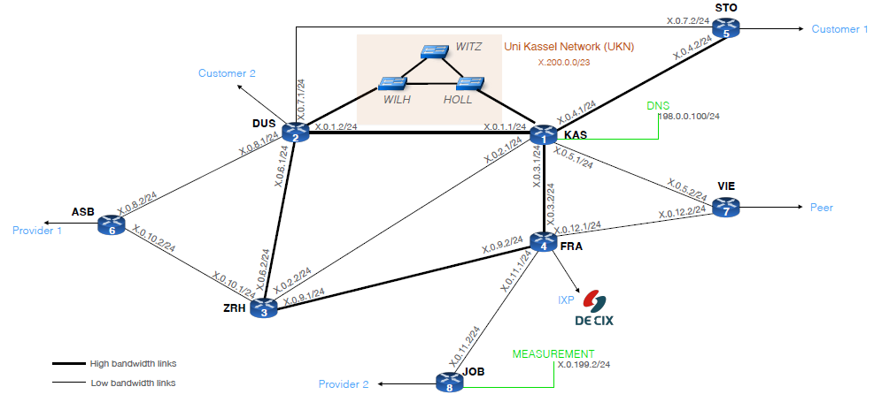

# Technical Note: Partial Configuration Scripts

> **Notice:** The scripts included in this repository (e.g., `DUS_router_CONFIGURE.sh`, `FRA_router_CONFIGURE.sh`) represent a **partial subset** of the complete Autonomous System configuration. 

These files are provided for demonstration purposes to showcase:
* **Automation:** The use of Bash scripting to provision FRRouting (FRR) nodes.
* **Policy Logic:** Representative examples of BGP Route-Maps and OSPF weight configurations.
* **Role-Based Design:** Configuration patterns for specific network roles, such as IXP Peering at FRA or Transit at DUS.

The full project environment consists of 8 interconnected routers and an Open vSwitch Layer-2, which were managed as part of the University of Kassel "Mini-Internet" project.

